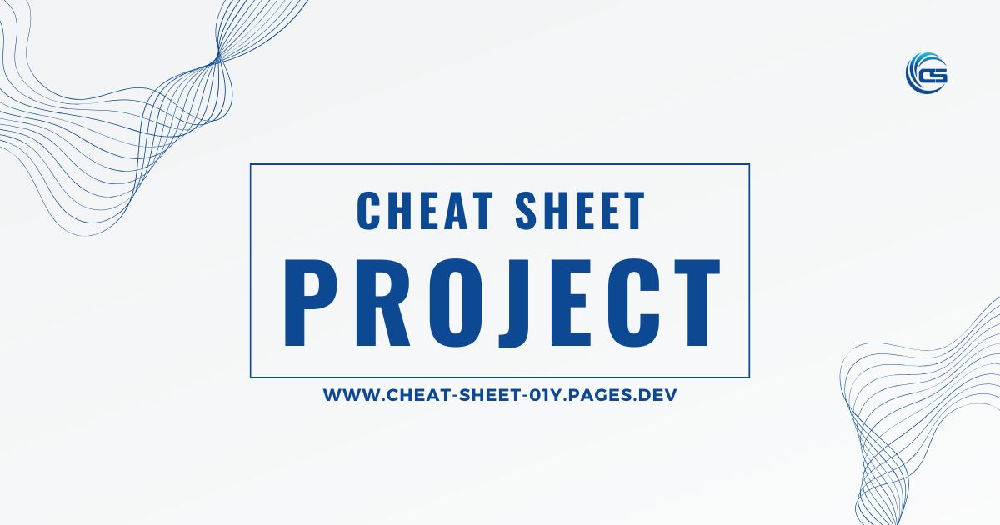

# Cheat Sheet Project

Welcome to the Developer's Cheat Sheet Project! This is a growing collection of cheat sheets for various programming languages, libraries, and frameworks, all in one place. If you're looking to learn something new or need a quick reference guide, you've come to the right place!

## What's Inside

This project is built with [Astro.js](https://astro.build/), a front-end framework for building fast, optimized websites and applications. Cheat sheets are written in Markdown, making them easy to create, update, and read.

## How to Contribute

We're always looking for contributions! If you have a cheat sheet you'd like to add, or if you see something that could be improved, please feel free to contribute.

Please ensure your pull request adheres to the following guidelines:

- Descriptive commit message and pull request title.
- Clear, readable Markdown with proper spelling and grammar.
- Relevant and concise content.

## License

This project is open source and available under the [MIT License](LICENSE).

## Contact

If you have any questions, feel free to open an issue or submit a pull request. Happy coding!
